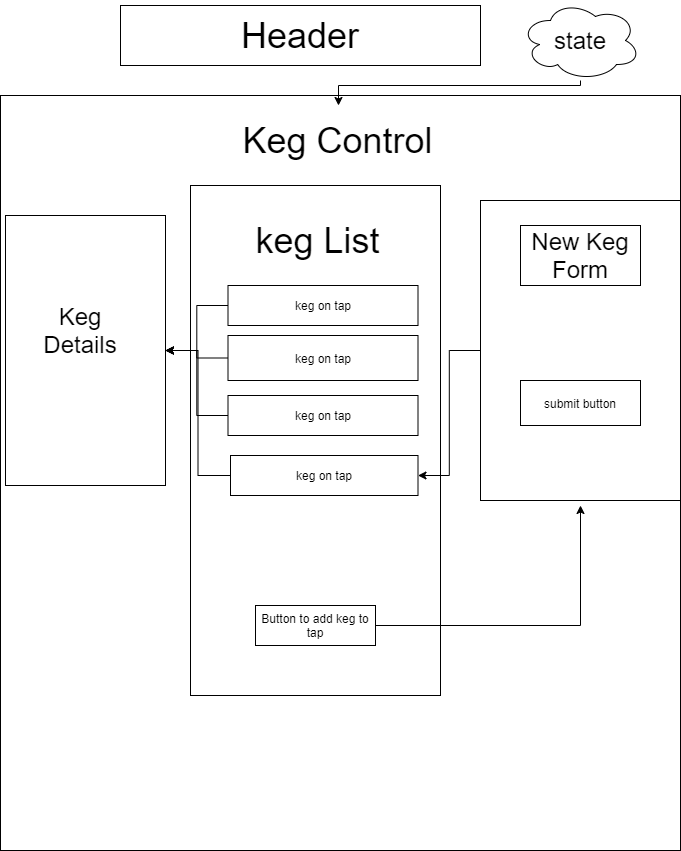

# Todd's Tap Room

#### _A React Application for a fake bar_

#### By _**Todd Walraven | April 24 2020**_

## Description

This React application allows users to add kegs of beer to a taproom. users can update and delete kegs from a taplist as well as view details of each keg they add to the taproom.

## Specifications:

* A user will be able to pull a full list of beers on tap
* A user will be able to add new beers to the taproom.
* A user will be able to edit an beer entry in the taproom by filling out form.
* A user will be able to remove an entry from the taproom.

## Component Diagram

## Setup/Installation Requirements

_Enter the following commands in Terminal (macOS) or PowerShell (Windows):_
* ``cd desktop``
* ``git clone https://github.com/Todders92/tap-room-v2``
* ``cd tap-room``

_Confirm that you have navigated to the tap room directory (e.g., by entering the command_ ``pwd`` _in Terminal)._

_install dependancies for the application by using the command npm install_
* ``npm install``

_Run the application by using the command npm run start_
* ``npm run start``

_To view/edit the source code of this application, open the contents of the ``tap-room`` directory in a text editor or IDE of your choice (e.g., to open all contents of the directory in Visual Studio Code on macOS, enter the command_ ``code .`` _in Terminal)._

## Technologies Used
* _Git_
* _React_
* _Node.js_

### License

*This webpage is licensed under the MIT license.*

Copyright (c) 2020 **_Todd Walraven_**